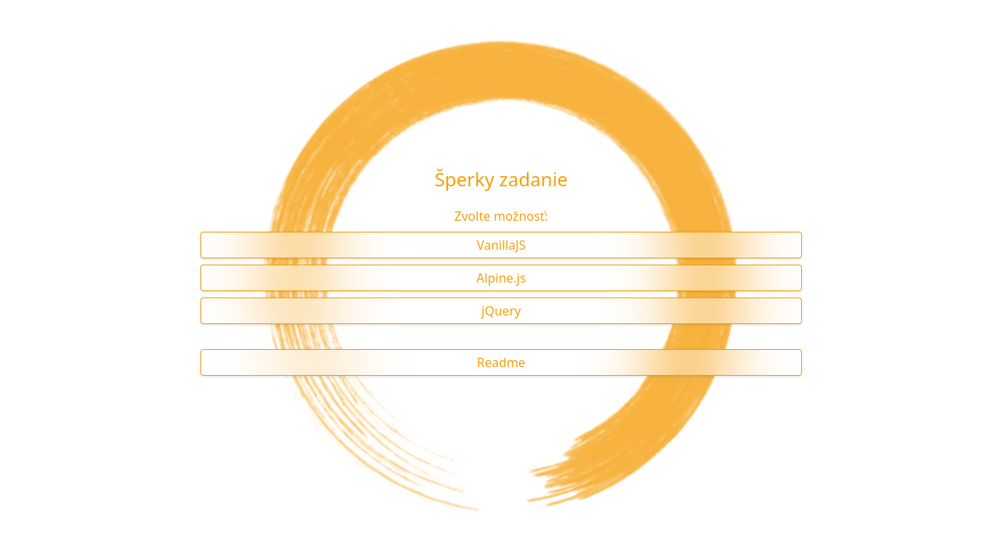
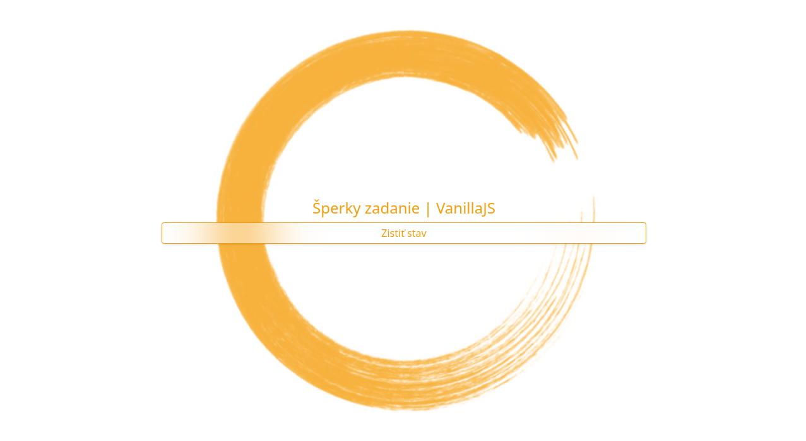
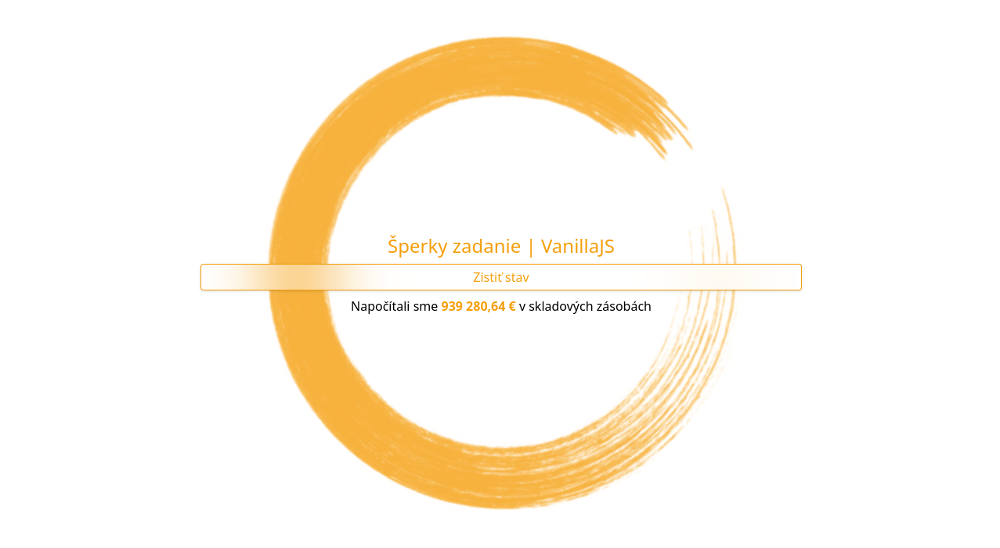

# Sperky Zadanie

- [Sperky Zadanie](#sperky-zadanie)
    * [Requirements](#requirements)
    * [Installation](#installation)
    * [Database setup](#database-setup)
    * [Frotnend](#frotnend)
        + [VanillaJS](#vanillajs)
        + [jQuery](#jquery)
        + [Alpine.js](#alpinejs)
    * [Backend](#backend)
        + [Action Handling](#action-handling)
        + [Alternative usage](#alternative-usage)
        + [Expanding Actions](#expanding-actions)
            * [1. Create new strategy](#1-create-new-strategy)
            * [2. Add new case to ActionEnum](#2-add-new-case-to-actionenum)
            * [3. Add new match to ActionStrategyFactory](#3-add-new-match-to-actionstrategyfactory)
        + [JSON Response Examples](#json-response-examples)
        + [GetWarehouseValue and SQL Query](#getwarehousevalue-and-sql-query)
        + [Database and Query classes](#database-and-query-classes)
        + [Product Model and ProductRepository](#product-model-and-productrepository)


## Requirements
- PHP 8.3
- MariaDB/MySQL

## Installation

Clone the repository or extract zip from release and enter the project directory.
Then run local PHP development server:
```shell
php -S 127.0.0.1:8000
```
Navigate to 127.0.0.1:8000 using your favorite browser.

Alternatively if you have web server already set up you can just put project files into document root.


## Database setup

This demo includes script that populates `App/Database/config.php` with provided database information and runs
included `DatabaseSeeder::seed()` that generates 10 products and 10 product_attributes with some **pids** colliding
between
them

You can also update `App/Database/config.php` manually however **make sure to also add sample data to your database
manually**.

```shell
php setup.php

# ---------------------------------------
# This is a setup script for Sperky,
# please provide needed information
# ---------------------------------------
# Please enter Database host
# (Enter for localhost):
```
Or manually edit `App/Database/config.php`:
```php
return [
    'host' => 'localhost',
    'database' => 'sperky',
    'login' => 'user',
    'password' => 'pass',
];
```


## Frotnend

In this example I'm using TailwindCSS for making simple layout and design.
- `input.css` - Source CSS
- `output.css` - Compiled Tailwind CSS


There are currently 3 JavaScript implementations.


### VanillaJS
- [index.html](variants/vanillajs/index.html)
- [script.js](variants/vanillajs/script.js)
    - [action.js](variants/vanillajs/action.js)
    - [animator.js](variants/vanillajs/animator.js)

### jQuery
- [index.html](variants/jquery/index.html)
- [script.js](variants/jquery/script.js)

### Alpine.js
- [index.html](variants/alpinejs/index.html)
- [script.js](variants/alpinejs/script.js)

## Backend

The entry point for this application is `action.php`, which accepts POST requests with `action` and optionally `data`
parameters.

### Action Handling

Requests are managed by the `ActionHandler` class, which follows these steps:

1. **Validate Action**: Uses `ActionEnum` to check if the action is valid.
2. **Get Strategy**: Uses `ActionStrategyFactory` to retrieve the appropriate `ActionStrategy`.
3. **Execute Strategy**: Runs the `execute()` method of the strategy, which returns a `JsonResponse`.
4. **Handle Failure**: Returns a `FailedJsonResponse` if there is an error.

The `send()` method of the `JsonResponse` or `FailedJsonResponse` class sends an application/json response to the client
and terminates execution.

### Alternative usage

Here are alternative ways to handle actions:

1. **Using the Factory**

```php
ActionStrategyFactory::getStrategy(ActionsEnum::GET_WAREHOUSE_VALUE) // Get strategy
     ->execute($data) // Execute strategy
     ->send(); // Send JSON Response
```

2. **Using a Strategy Directly**

```php
( new GetWarehouseValueStrategy() ) // Get strategy
  ->execute($data) // Execute strategy
  ->send(); // Send JSON Response
```

```php
( new GetWarehouseValueStrategy() ) // Get strategy
  ->execute($data) // Execute strategy
  ->response; // Get response value
```

3. **Directly Using Product**

```php
Product::getWarehouseValue(); // float value
```

4. **Creating JSON Response Directly**

```php
( new JsonResponse( Product::getWarehouseValue()) )->send(); // Send JSON Response
```

This defaults to HTTP 200 application/json success response:

```json
{
  "status": true,
  "response": 126
}
```

### Expanding Actions

- Supported actions need to be added to `App/Enums/ActionsEnum.php`
- After that corresponding new `ActionStrategy` implementing `ActionStrategyInterface`
  needs to be created and added to `App/Functions/ActionStrategies/ActionStrategyFactory.php`

##### 1. Create new strategy

```php
// App/Functions/ActionStrategies/DoNothingStrategy.php

class DoNothingStrategy implements ActionStrategyInterface
{
    public function execute(?string $data): ResponseInterface
    {
        return new JsonResponse('Did nothing');
    }
}
```

##### 2. Add new case to ActionEnum

```php
// App/Enums/ActionsEnum.php
enum ActionsEnum: string
{
    case DO_NOTHING = 'doNothing';
    // ...
}

```

##### 3. Add new match to ActionStrategyFactory

```php
// App/Functions/ActionStrategies/ActionStrategyFactory.php
class ActionStrategyFactory
{
    // ... 
    public static function getStrategy(ActionsEnum $action): ActionStrategyInterface
    {
        return match ( $action ) {
            // Add Strategies here
            ActionsEnum::DO_NOTHING => new DoNothingStrategy(),
            // ...
        };
    }
}

```

### JSON Response Examples

- Success response:

```json
{
  "status": true,
  "response": 126
}
```

- Failed response:

```json
{
  "success": false,
  "response": "Invalid action specified"
}
```

### GetWarehouseValue and SQL Query

Calling `Product::getWarehouseValue()` uses `ProductRepository::getProductsAndAttributes()` to run SQL query, after calculations it returns float value in EUR.

This query located in `App/Repositories/ProductRepository.php` collects data from both `product`
and `product_attribute` tables, while using `product_attribute` values when pid of product_attribute collides with the
pid of product:

```sql
-- Select rows from products that do not have matching pid in product_attribute:
SELECT pid,
       purchase_price_usd,
       rate_eur_usd,
       stock_quantity
FROM product
WHERE pid
          NOT IN (SELECT pid FROM product_attribute)

-- Select rows from product_attribute and add them to results:
UNION
SELECT pid,
       purchase_price_usd,
       rate_eur_usd,
       stock_quantity
FROM product_attribute
```

After that USD to EUR conversion is applied for each item and the result is multiplied by current stock quantity:

```php
$result = 0;
foreach ( $products as $product ) {
    $result += ( $product->purchase_price_usd / $product->rate_eur_usd ) * $product->stock_quantity;
}
return round($result, 2);
```

### Database and Query classes

For this project I decided to make simple Database class that handles database connection (using credentials
from `App/Database/config.php`) and simple PDO Query wrapper:

```php
// Example usage:
Query::create("INSERT INTO `contacts` (name) VALUES (:name)")
    ->exec([
        ':name' => 'test',
    ]);

// Get Row object
$delaja = Query::create("SELECT * FROM `contacts` WHERE name = :name")
    ->getRow([
        ':name' => 'Delaja',
    ]);

// Get array<Row>
$usersWithE = Query::create("SELECT * FROM `users` WHERE name LIKE 'e%'")
    ->getRows();


// Standard FETCH_ASSOC array if needed
$fetchAssoc = Query::create("SELECT * FROM `users` WHERE name LIKE 'e%'")
    ->getRowsAsArray();
```

The `getRow()` and `getRows()` methods return Row/array of Row objects.
Row objects use array internally but allow accessing its values as properties, this is just my preference, so I
included `getRowAsArray()` and  `getRowsAsArray()`
methods that return standard associative arrays.

```php
$row = new Row([
    'name'=>'Delaja',
]);

echo $row->name;
// Delaja
```

### Product Model and ProductRepository
I also created a simple Model and Repository classes utilizing Late Static Bindings.
This allows us to call static methods like Product::create() without reinitializing the repository with each call.

All we need to do is to extend Model and add following snippet with corresponding Repository:
```php
// Product.php

/**
 * Define repository for this model
 * 
 * @return ProductRepository
 */
protected static function createRepository(): ProductRepository
{
    return new ProductRepository();
}
```

Parent class Model handles Repository initialization for each of its subclasses. We can then use repository in our model static methods like this:
```php
// Product.php

/**
 * Create new product
 *
 * @param array $productData
 *
 * @return bool
 */
public static function create(array $productData): bool
{
    static::validate($productData);
    return static::getRepository()->create($productData);
}
```

Database interactions are handled inside the model repository.


## Screenshots


